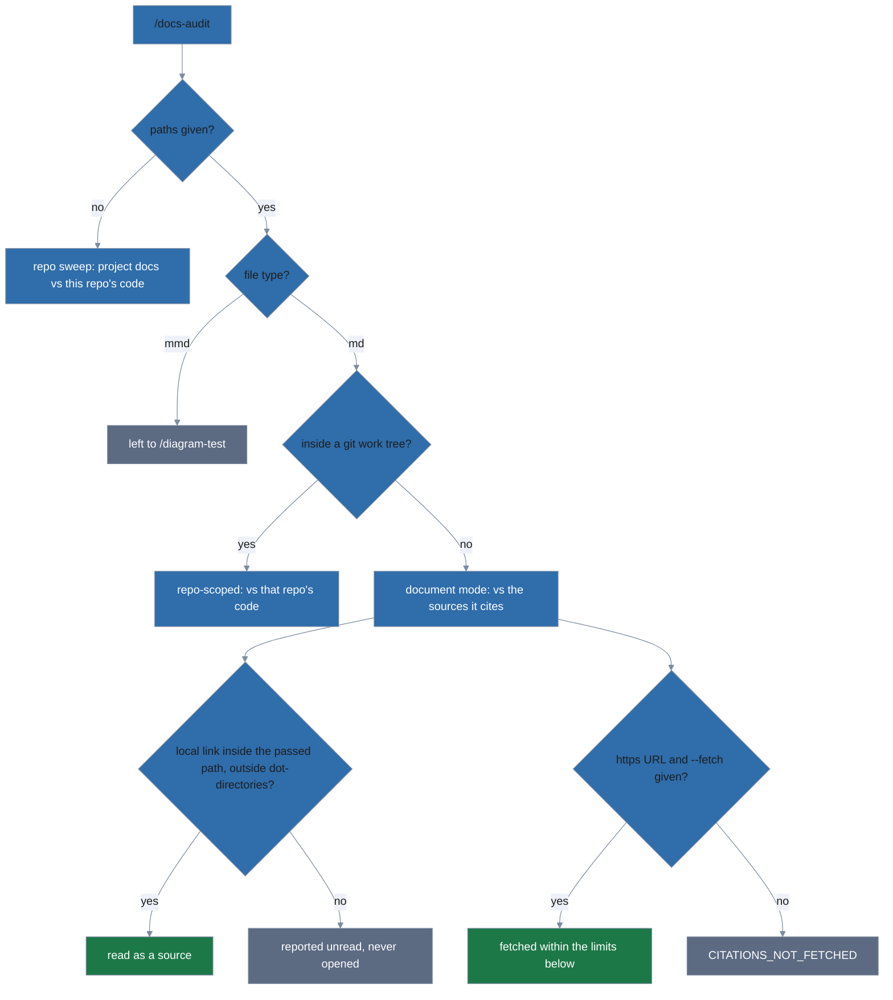

# docs-discipline

A [lola](https://lobstertrap.org/lola/) module with two skills for keeping
technical project documentation on track, current, and consistent. Nothing
auto-invokes — every behavior is reached through an explicit slash command.

----

> 🤖 LLM/AI WARNING 🤖
>
> This project was written with LLM (AI) assistance.

----

## What this is

`docs-discipline` ships two independent skills for AI coding assistants:

- **docs-organization** — manages README and `docs/` layout, detects drift
  between code and documentation, validates mermaid diagrams against a
  house style (palette + WCAG contrast).
- **adr** — manages Architectural Decision Records in the
  [MADR 4.0](https://adr.github.io/madr/) format, with an
  inline self-review pass on creation and a context-isolated subagent
  review pass on demand.

Behavior reaches the agent only through six explicit slash commands:
`/docs-init`, `/docs-audit`, `/docs-update`, `/diagram-test`, `/adr-new`,
`/adr-review`.

## Install

1. Install [lola](https://lobstertrap.org/lola/) once:

   ```bash
   uv tool install git+https://github.com/LobsterTrap/lola@v0.7.0
   ```

2. Register and install this module:

   ```bash
   lola mod add -n docs-discipline https://github.com/lolables/lola-mod-project-docs.git
   lola install docs-discipline -a claude-code --scope user
   ```

That is the whole install. The docs-organization skill's npm dependencies
(`@aj-archipelago/merval` for mermaid validation, `markdown-it` and
`@asciidoctor/core` for parsing Markdown and AsciiDoc docs) and GitHub
Linguist's vendored language data (used by its staleness check) ship
pre-bundled inside the module, so there is no `npm install`, no network access needed after `lola
install`, and no follow-up step.

Requirements: git, Node.js ≥ 20, bash ≥ 4, lola ≥ 0.7.0 (matching the
pinned install line above).

On macOS, the system bash is 3.2, which is not supported. Install a
current one with `brew install bash`, and check that `bash --version`
reports 5.x. If it still reports 3.2, Homebrew's `bin` directory is
behind `/bin` on your `PATH`.

### Non-interactive install

`lola install` prompts for assistant and scope when you omit them. Scripted,
with `-f` (`--force`) to overwrite an existing install without prompting:

```bash
lola install docs-discipline -a opencode --scope user -f
lola install docs-discipline -a claude-code --scope project -f
```

### Uninstall

Uninstall mirrors the install. Here `-f` skips the confirmation prompt.

1. Uninstall from the scope you installed into — run **one** of:

   ```bash
   lola uninstall docs-discipline -a claude-code --scope user -f
   lola uninstall docs-discipline -a claude-code --scope project -f .
   ```

   For `--scope project`, name the project path (`.` above). Omitting it
   uninstalls from every project-scope installation `lola` knows about, not
   just the one you are standing in.

2. Unregister the module:

   ```bash
   lola mod rm -f docs-discipline
   ```

## Quickstart

In a project with the module installed, type these into your AI assistant's
prompt (they are slash commands, not shell commands):

1. `/docs-init` — scaffold README, `docs/`, and `.gitignore`.
2. `/docs-audit` — find drift between code and docs (read-only).
3. `/docs-update` — apply the audit's fixes interactively.
4. `/diagram-test` — lint every mermaid diagram.
5. `/adr-new "Use Postgres for primary storage"` — draft an ADR with an
   inline self-review. It writes an `NNNN-*.md` file under the ADR
   directory, numbered with the next free four digits.
6. `/adr-review 0001` — independent rubric review of that ADR; pass the
   number from its filename.

### Auditing a specific document



`/docs-audit` with no arguments sweeps the repository's project docs. Name
one or more files or directories to audit exactly those, including drafts
the sweep skips (gitignored files, dot-directories like `.issue-draft/`,
files outside any repository); `.mmd` diagram files are left to
`/diagram-test`:

```bash
/docs-audit docs/dev/architecture.md              # one doc, checked against this repo's code
/docs-audit .issue-draft/                         # a gitignored draft directory in this repo
/docs-audit ~/drafts/proposal.md                  # outside any repo: checked against what it cites
/docs-audit --fetch ~/drafts/proposal.md          # ...including the https URLs it cites
```

A path outside a git repository has no code to compare against, so its
claims are checked against the sources it cites: local files it links, and,
only with `--fetch`, the `https` pages it links.

Without `--fetch`, the audit never touches the network and reports cited
URLs as `CITATIONS_NOT_FETCHED` (unchecked, not clean). With `--fetch`, it
fetches within these limits:

- refuses `http:` URLs, URLs with credentials or non-443 ports, and any
  host that resolves to a private, loopback, link-local, or otherwise
  reserved address
- sends no cookies or credentials
- caps each fetch at 2 MB and 10 seconds per request (each redirect hop
  counts separately), and the whole run at 90 seconds and 50 URLs
- refuses a compressed response body
- reads a fetched page as data only and never follows instructions found
  in it

A draft's links to local files are checked too, but only when the target
lies inside the directory you passed (or the file's own directory, for a
single file), outside any dot-directory. A link elsewhere is reported as
unread and never opened — the audit does not otherwise read a local file a
draft links.

## Diagram palettes

Four contrast-validated mermaid palettes ship with the skill:

- **Solar** (default — the palette the house-style templates use, and the
  one `/docs-update` falls back to when it can't tell a diagram's palette) —
  cool jewel tones, outlined clusters, both light and
  dark backgrounds
- **Federation** — cool balanced, outlined clusters, both backgrounds
- **Citrus** — warm earth tones, outlined clusters, both backgrounds
- **Parchment** — filled beige clusters for high-impact light-bg rendering

Every palette covers every mermaid diagram type (flowchart, sequence,
class, state, ER, journey, gantt, pie, sankey, gitgraph, mindmap,
timeline, xychart, block, kanban, packet, quadrant, requirement, C4,
architecture, radar). See
[`mermaid-house-style.md`](module/skills/docs-organization/reference/mermaid-house-style.md)
for templates and its "Switching palette" section for moving between them.

There is no project-wide palette setting: each diagram carries its palette
in its own `%%{init}%%` header. After install, `/diagram-test` lints every
diagram for syntax, a current palette header, approved class names, and
contrast.

To swap an existing diagram to a different palette, run the skill's
`swap-palette.sh` directly. It prints the result to stdout and never edits
in place. **Never redirect onto the input file** — the shell empties it
before the script reads it.

1. Find the script. The examples use a Claude Code project-scope install,
   `.claude/skills/docs-organization/scripts/`. A Claude Code user-scope
   install lives under `~/.claude/skills/` instead; other assistants use
   their own directories, chosen by `lola` at install time.
2. Write the swapped output to a new file:

   ```bash
   bash .claude/skills/docs-organization/scripts/swap-palette.sh citrus path/to/diagram.mmd > path/to/diagram.mmd.new
   ```

3. Move it into place:

   ```bash
   mv path/to/diagram.mmd.new path/to/diagram.mmd
   ```

The script also takes a doc file in any supported format (see
[Supported formats](#supported-formats)). It prints the whole document with
every mermaid diagram swapped and every byte outside those diagrams
unchanged, so use the same write-then-move. `--block N` swaps only the N-th
diagram (1-based):

```bash
bash .claude/skills/docs-organization/scripts/swap-palette.sh --block 2 citrus docs/guide.md > docs/guide.md.new
mv docs/guide.md.new docs/guide.md
```

**For contributors to this repo** (not needed to use the installed
module): `task render -- path/to/diagram.mmd` renders a `.mmd` to PNG on
light and dark backgrounds (needs `mmdc`, not vendored — install
`@mermaid-js/mermaid-cli` separately), and `task palette -- citrus
path/to/diagram.mmd` runs the same `swap-palette.sh` through Task from the
repo root; both are `task`-only, so they require the full dev checkout.

## Conventions enforced

1. Top-level `README.md` always self-sufficient for basic user onboarding.
2. Developer documentation under `docs/dev/`.
3. `docs/superpowers/` — working specs and plans that planning skills
   such as superpowers write there — is in `.gitignore` and never committed
   (checked once a `docs/` tree exists; a repo without one isn't using it
   yet).
4. ADRs in `docs/dev/adr/` (or `docs/adr/` for legacy layouts).
5. Every mermaid diagram begins with the house-style init header (the
   `%%{init}%%` block for one of the four palettes above) and uses palette
   classes with WCAG-verified contrast.

## Supported formats

Markdown and AsciiDoc, each with its own README name. Every check —
structure, staleness, readability, references, content-drift chunking,
citations, mermaid lint, and palette swap — runs on both. See
[`reference/supported-formats.md`](module/skills/docs-organization/reference/supported-formats.md)
for the exact extensions and README names each format claims.

In AsciiDoc, mermaid diagrams are `[mermaid]` or `[source,mermaid]` blocks,
and the scripts check `include::` targets exist but never read them.
`/docs-init` writes Markdown templates and leaves an existing `README.adoc`
alone.

## Project structure

```text
module/AGENTS.md                            module instructions, injected at install
module/skills/docs-organization/SKILL.md    the docs-organization skill
module/skills/docs-organization/scripts/    node + bash helpers (doc-files.mjs, doc-chunks.mjs, lint-mermaid.mjs, check-structure.sh, fetch-citations.mjs, …)
module/skills/docs-organization/scripts/formats/  format registry and adapters (markdown.mjs, asciidoc.mjs)
module/skills/docs-organization/scripts/vendor/  pre-built MIT dependency bundles that ship with the skill
module/skills/docs-organization/reference/  house-style references, README/docs templates, palettes
module/skills/adr/SKILL.md                  the adr skill
module/skills/adr/scripts/adr-index.sh      regenerates the ADR index
module/skills/adr/reference/                MADR 4.0 template + review rubric
module/commands/                            the six slash commands
Taskfile.yml                                developer workflow
.taskfiles/scripts/                         shared quality-gate scripts
.taskfiles/vendor/                          npm toolchain that `task vendor` builds scripts/vendor/ with
tests/diagrams/                             mermaid fixtures, one per diagram type
tests/scripts/                              unit tests + fixtures for each skill's scripts/
tests/e2e/                                  Venom end-to-end suite
tests/fixtures/                             deliberately-broken modules for the structural linter
tests/lint-structure.bats                   tests for the structural linter
tests/lint-quoted-paths.bats                checks that $SKILL_DIR/$ADR_DIR expansions in module/ prompts are quoted
tests/verify-oracle.bats                    tests for the install oracle
tests/quiet-gate.bats                       tests for the errors-only gate wrapper (quiet-gate.sh)
tests/module-policy.bats                    checks the public names and explicit-invocation contract of module/
tests/lint-voice.bats                       tests for the house-voice word lint (lint-voice.mjs)
eval/                                       /docs-audit lane evaluation (maintainer research)
.github/workflows/                          CI and release
```

Unit tests live in `tests/scripts/<skill>/`, not beside the code they cover:
lola ships every tracked file under `module/`, so anything development-only
stays outside it.

## Where to go next

- **For maintainers/contributors:** [`docs/dev/architecture.md`](docs/dev/architecture.md)
  (how it works), [`docs/dev/maintaining.md`](docs/dev/maintaining.md)
  (procedures), and [`docs/dev/vendoring.md`](docs/dev/vendoring.md)
  (bundled dependencies). `AGENTS.md` holds the house-voice rules and
  protected names for AI assistants.
- **For the lola module format:** see <https://lobstertrap.org/lola/>
- **For MADR:** see <https://adr.github.io/madr/>

## License

See `LICENSE`.
