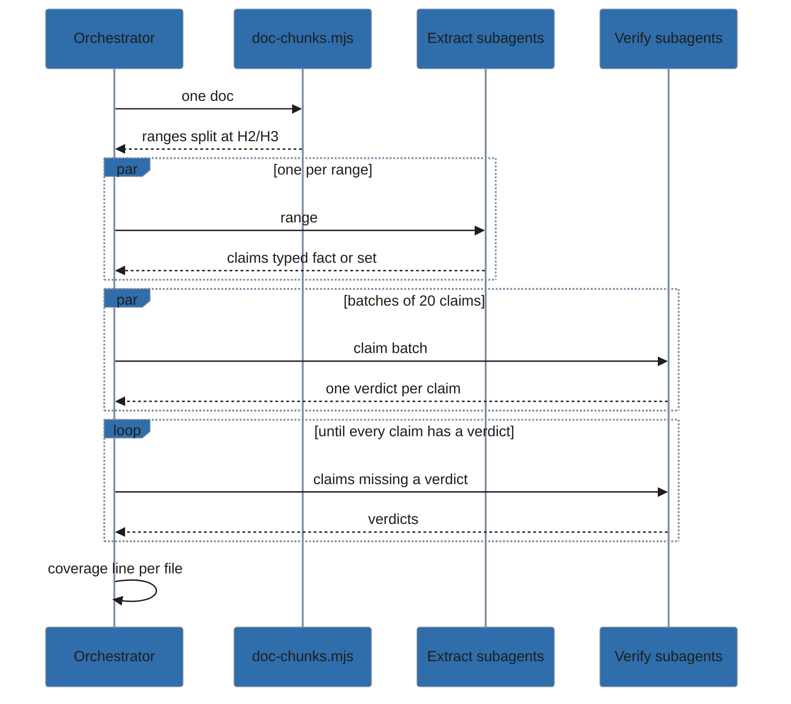
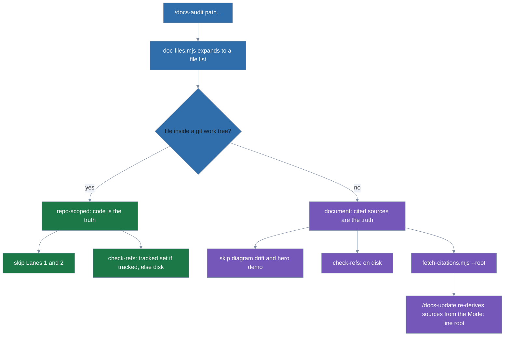
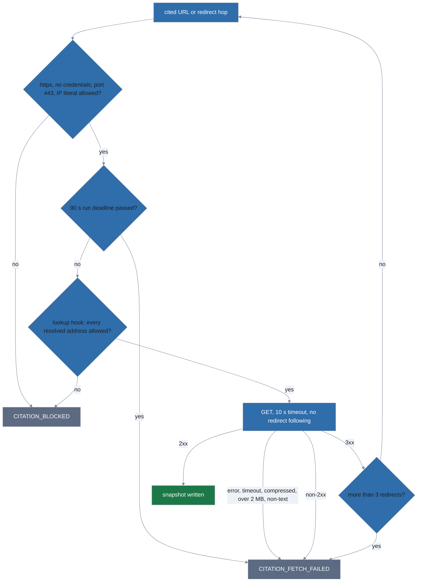

# docs-discipline internals

The maintainer-facing companion to the root `AGENTS.md`. Where `AGENTS.md` says
what to do, this says how the machinery works, so a future maintainer can
change it without breaking something subtle.

## Skill-relative helper paths

Both skills ship executable helpers next to their `SKILL.md`. The install
destination varies by host and scope — `~/.claude/skills/`,
`~/.config/opencode/skills/`, `<project>/.opencode/skills/`, and more — so no
helper path can be hardcoded.

Each `SKILL.md` opens with a "Helper paths" preamble telling the agent to
anchor on the file it was loaded from:

```bash
SKILL_DIR=$(dirname "$(realpath <skill-md>)")
bash "$SKILL_DIR/scripts/check-structure.sh"
cat "$SKILL_DIR/reference/mermaid-house-style.md"
```

Every `scripts/…` and `reference/…` reference is written as `"$SKILL_DIR/…"`.
The structural linter enforces this: any skill shipping helper files must
contain a `SKILL_DIR` anchor instruction, or `task lint` fails.

When `/docs-update` hits a `MISSING_ADR_INDEX` finding, it activates the `adr`
skill as well and binds `$ADR_DIR` — the `adr` skill's counterpart to
`$SKILL_DIR`, used to run `adr-index.sh` — from that skill's loaded location
the same way.

## Six commands, two skills

The commands are not one-per-skill. `/docs-init`, `/docs-audit`,
`/docs-update`, and `/diagram-test` all front `docs-organization`; `/adr-new`
and `/adr-review` front `adr`. `/docs-update` reaches both, and so does
`/docs-init` when it creates `docs/dev/README.md`, which links the ADR index.

This is why the shared structural linter binds commands to skills **by
reference** rather than by filename. A command is valid if its filename matches
a skill directory or its body names one; an explicit skill is valid if any
command names it. The original linter in `lola-mod-template` — the shared
template for [lola](https://lobstertrap.org/lola/) modules (lola is the
cross-host packager that installs this module) that these gate scripts come
from — required a one-to-one filename match and
rejected this module outright.

## The `/docs-audit` lanes

`/docs-audit` splits into deterministic script-owned lanes and model-owned
judgement. The command file marks the split with an `<EXECUTION-CONTRACT>`
block, and the contract is strict: the agent must run the named script and use
its JSON verbatim rather than eyeballing the file, even when reading directly
would be faster.

| Lane | Script | Finds |
| --- | --- | --- |
| 1 structural | `check-structure.sh` | missing or empty README, ungitignored `docs/superpowers/` (working specs and plans that planning skills such as superpowers write), drafts there tracked in git, an ADR directory with no `index.md`, a forked copy in a symlinked doc tree (`FORKED_COPY`) |
| 2 staleness | `check-staleness.mjs` | docs older than the code they describe; reports `STALENESS_NOT_ASSESSED` when no commit ever touched a file Linguist classifies as source |
| 3 readability | `check-prose.mjs` | wall-of-text, dense bullets, oversized files and sections |
| 4 reference integrity | `check-refs.mjs` | broken links and file references |
| 5 mermaid | `lint-mermaid.mjs` | syntax, init header, palette classes, contrast |
| 6 LLM | — (subagent-driven); `doc-chunks.mjs` for the drift claim ledger; `fetch-citations.mjs` in document mode | content drift, missing diagrams/demo, cold-read comprehension, mode mixing, completeness for type, unscannable procedures; cited-source snapshots |

Lane 6 is the model-owned exception: a grounding subagent classifies each
file's Diátaxis mode first, then a separate subagent runs each applicable
prompt for that file — never grouped across files or prompts, per the
dispatch measurements in `eval/REPORT.md`.

Content drift goes further than one subagent per file and prompt. A
subagent asked to judge a whole doc reports one or two drifts and silently
drops the rest, so drift runs as a claim ledger (Rounds 14-15 in
`eval/REPORT.md`):

1. `doc-chunks.mjs` splits the doc at H2/H3 headings into ranges of at most
   100 lines (one range at 150 lines or fewer; a longer section stays whole).
2. An extract subagent per range lists every checkable claim, typed `fact`
   (one thing) or `set` (a count, an only/both/all, or a list that names its
   items — kept as one claim).
3. Verify subagents take the claims in batches of 20 and must return one
   verdict per claim; for a set they list the doc's members and the code's
   full group before judging.
4. The orchestrator checks every claim got a verdict, retries the rest, and
   reports a coverage line per file, so "no drift" can be told apart from
   "not checked".



Lane 2 classifies source with GitHub Linguist's language, vendor, and
documentation data (vendored at a pinned tag as `scripts/vendor/linguist.json`)
rather than a hand-maintained marker list. `.taskfiles/scripts/build-linguist-data.mjs`
derives the exact rule: an extension counts if a programming or markup
language claims it, no prose language also claims it (`.md` is out — Markdown
claims it), and no data language lists it as that language's primary
extension (`.sql` is out — SQL's primary extension). A filename counts only
if every language that lists it is programming or markup. A path is never
source if it is vendored, documentation, or under a dot-directory.

`check-staleness.mjs` classifies by path name, so a commit that deletes a
source file, or only resolves a merge conflict in one (the script's `git
log` passes `--cc` so merge commits list those paths),
still counts as a source change. When no commit ever touched a source path,
staleness is unknown, not clean — the script reports `STALENESS_NOT_ASSESSED`
rather than a silent pass.

A doc is judged stale by commit ancestry, not by comparing commit
timestamps: the script records the SHA of the latest source commit, and a
doc is stale iff its own last-commit SHA differs from that SHA and is its
ancestor (`git merge-base --is-ancestor`). Two commits landing in the same
second compare equal under a timestamp, and a committer date can be
skewed relative to where a commit actually sits in history — ancestry
answers "did this doc predate that source change?" directly from the
graph instead. `STALE_DOC` also resolves each doc's realpath before
reporting, collapsing a symlink and its target into one finding at the
target's canonical path (the same dedupe Lane 3 applies below), and
excludes ADRs (`docs/dev/adr/`, `docs/adr/`) — they're dated records, not
descriptions that drift.

The scan walks `git log` newest-first and stops at the first commit that
touches a source path, rather than restricting by pathspec — a pathspec glob
forces git to evaluate it against every changed path in every commit, which
measured 2-4x slower than the unfiltered walk. Stopping at the first match
keeps the worst case (a repo whose only source commit is the first one) to
about 1s per ~35k commits of history (measured on django), and far less
whenever source was touched recently.

Lanes 3 and 4 walk the documentation tree with the shared `doc-files.mjs`
helper, which is symlink-aware: a symlinked doc file is included, a
symlinked directory is not descended. Lane 3 dedupes a symlink and its
target into one document, reported at the target's path; Lane 4 checks
links from every path a doc is reached by, symlinks included, so a
relative link is verified from wherever a reader actually opens it. Both
report `scanned` in their JSON, so an empty result can be told apart from a
lane that read nothing. Lane 4 and `fetch-citations.mjs` both read the model
`formats/index.mjs` returns; for a Markdown file that model comes from
`formats/md-lines.mjs`, which stamps every markdown-it inline token with its
exact source line so a link and a cited URL are reported on the line a
reader finds them. `md-lines.mjs` is internal to the Markdown adapter —
nothing outside `formats/` imports it.

Convention 2 in `AGENTS.md` — developer documentation under `docs/dev/` — is
model-owned, not script-owned. Lane 1 does not check for it.

## Path mode and document mode

`/docs-audit <path>...` skips repo enumeration: `doc-files.mjs` expands the
arguments into one explicit file list that every lane receives, so no lane can
disagree with another about what a directory contains. Each file then picks
its source of truth from where it lives:

- **Inside a git work tree (repo-scoped).** The repo's code is the truth, as in
  a sweep. Lanes 1 and 2 are skipped because they describe the whole repo, not
  the named files.
- **Outside any work tree (document).** There is no code, so content drift
  compares the doc against the sources it cites. Diagram drift and the hero
  demo prompt (the Lane 6 check that suggests a recorded demo for a runnable
  tool's README, `MISSING_DEMO`) are skipped.

That one per-file test decides four things at once:



`check-refs.mjs` makes the same choice per file rather than once per run. A
tracked doc is checked against the tracked set, as before. A doc outside
git, or an untracked doc named explicitly, is checked on disk. `REF_NOT_IN_GIT`
exists to catch links that dangle for someone who clones, and a doc that
isn't in git has no cloner. Since `check-refs.mjs` audits every file it is
given, untracked ones on disk, a repo sweep's gitignore and dot-directory
exclusions rely entirely on the in-scope file list the audit builds and passes
to Lanes 3 and 4 alike.

`fetch-citations.mjs --root <root>` resolves a document's local links the
same way: it finds each target's realpath and checks whether that realpath
lies inside `--root`, outside any dot-directory. The script only stats and
realpaths a local source; it never reads one. Containment matters because
the document is untrusted input — without this check, a hostile draft
linking `../../.aws/credentials` would get that file read and quoted into a
subagent's context.

Two checks apply at different points, on purpose:

- **Docs are checked lexically**, by the path they were reached by, so a
  symlinked doc tree is audited without dereferencing.
- **Local sources are checked by realpath**, so a symlinked source can't
  point outside `--root` and still pass.

`/docs-update` re-derives a finding's local sources the same way before
re-reading any file — it runs `fetch-citations.mjs --offline --root <root>`
and never `--out`, so it never fetches. `<root>` comes from the audit's
`Mode:` line, which the audit's findings report (its punch list) prints per group in path mode and which
names every root the audit passed to `fetch-citations.mjs`, e.g.
``Mode: document; root: `/home/me/drafts` — 2 file(s); skipped: …``.

### Why fetching is a script



Document mode can check claims against the `https` pages a doc cites, which
makes the audit a network client driven by an untrusted document. A draft can
link `https://169.254.169.254/…` (cloud instance metadata), `localhost`, or an
intranet host. `fetch-citations.mjs` is the only component allowed to fetch,
and only under `--fetch`; Lane 6 subagents read its snapshot files and never
fetch themselves. Two reasons:

- **A filter in code can't be argued past.** A prompt rule ("don't fetch
  private hosts") is one more instruction that the doc or a fetched page can
  override. The script's checks run regardless of what the content says.
- **Host independence.** lola installs into hosts with different tool sets;
  reading files is the one capability every Lane 6 subagent already has.

Every cited URL is reported in WHATWG canonical form (`new URL(url).href`)
because it becomes a line in a snapshot's provenance header. The canonical
form strips a raw tab, newline, or carriage return and percent-encodes other
control characters in the path, query, and fragment, so a `%0A` in a cited
URL can't forge an extra header line. A control character in the host fails
to parse instead, and the extractor falls back to markdown-it's own
already-percent-encoded target.

The address check runs inside the `lookup` hook `https.request` calls, so it
judges the addresses the socket actually connects to. Resolving first and
fetching second would let a hostile DNS server answer differently the second
time (DNS rebinding). Node skips `lookup` for an IP-literal host, so
literals are checked before the request. Redirects are followed by hand, at
most three, and every hop goes through the same filter.

`net.BlockList` matches IPv4-mapped IPv6 addresses against the IPv4 ranges on
its own. Beyond that, six IPv6 ranges are blocked outright and one more is
decoded:

- Unique-local `fc00::/7`, link-local `fe80::/10`, and multicast `ff00::/8`
  are blocked outright.
- `::/96` (covering `::`, `::1`, and IPv4-compatible addresses) and the
  deprecated site-local range `fec0::/10` are blocked outright.
- The RFC 8215 local-use NAT64 prefix `64:ff9b:1::/48` is blocked outright
  too, because it may embed an IPv4 address outside its last 32 bits.
- The well-known NAT64 prefix `64:ff9b::/96` is judged by the IPv4 address
  in its last 32 bits, because on a NAT64 network that address is where the
  connection lands.

A response is refused outright when its `Content-Encoding` is anything other
than identity, rather than decompressed, closing off a decompression bomb.
Each request gets a 10-second timeout on top of that. A redirect hop is its
own request, so a three-redirect chain can take up to 40 seconds. The whole
run — no matter how many URLs it cites — gets a 90-second deadline; a hop
already in flight when the deadline passes is cut off, and no hop starts
after it.

Without `--fetch`, `fetch-citations.mjs --offline` still extracts the
citations and reports `CITATIONS_NOT_FETCHED`, so a doc whose claims rest on
URLs reads as unassessed rather than clean.

Splitting it this way is what makes the audit reproducible. The `eval/`
harness measures each lane's recall and false-positive rate against fixtures
with known ground truth; `eval/REPORT.md` records the results that justified
wiring each lane in.

## Document formats

Every script that reads a doc reads a `DocModel`, never a parser's tokens.
`scripts/formats/index.mjs` maps file extensions to adapters, and each
adapter turns one format into the model:

| Adapter | Parser | Notes |
| --- | --- | --- |
| `formats/markdown.mjs` | markdown-it + footnote, container (`:::`), admon (`!!!`) plugins | front matter blanked before parsing; GFM alerts detected on the blockquote; inline lines from `formats/md-lines.mjs` |
| `formats/asciidoc.mjs` | Asciidoctor.js 4 in `secure` mode | block lines from the public API; inline references from regexes over raw source lines (no inline AST, and text getters return HTML) |

Both adapters count lines through `formats/text.mjs` (`splitLines`,
`countLines`, `lineStarts`), which holds the one line-break rule —
markdown-it's `/\r\n?|\n/`. That is why LF, CRLF, and CR-only files report
the same line numbers whichever parser read them; an adapter that splits
lines its own way breaks that.

The model, in one example — this Markdown:

```markdown
# Guide

See [setup](setup.md) and §2.
```

parses to (abridged):

```json
{
  "lines": 3,
  "headings": [{ "level": 1, "line": 1, "title": "Guide" }],
  "paragraphs": [{ "line": 3, "text": "See [setup](setup.md) and §2.", "context": "top" }],
  "links": [{ "kind": "link", "target": "setup.md", "line": 3, "block": 1, "bare": false }],
  "texts": [
    { "text": "Guide", "line": 1, "block": 0 },
    { "text": "See ", "line": 3, "block": 1 },
    { "text": " and §2.", "line": 3, "block": 1 }
  ]
}
```

The full field list is the header comment of `formats/index.mjs`.

Decisions:

- **Adapters, not per-script branches.** A new format touches one file and
  the registry, not seven scripts.
- **`secure` mode for AsciiDoc.** Audited docs may be untrusted. Secure mode
  never reads an `include::` target or any other file; the adapter still
  reports the include so `check-refs` can verify the target exists.
- **No Asciidoctor internals.** Raw list-item and title text lives only in
  internal fields in Asciidoctor 4, so the adapter derives it from source
  lines and node start lines.
- **`.mdx` excluded.** Linguist classifies it as source, and markdown-it
  cannot parse JSX.
- **`.asc` not claimed.** PGP armor uses it too.

### Known limitations of the AsciiDoc adapter

Accepted on review, not planned fixes:

- `ifeval::[]` content is treated as kept; expressions are not evaluated.
- The single-line `ifdef::a[content]` form is always treated as excluded.
- Conditionals inside an AsciiDoc-style (`a|`) table cell get approximate
  line numbers. Nothing is dropped.
- A `link:` inside a `format=dsv` (colon-separated) table is not reported,
  because the `:` separator splits the macro.
- Any regex span (URL, link text, attribute list) longer than 2000
  characters is dropped, not truncated. This keeps scanning linear.

To add a format, follow [Add a document format](maintaining.md#add-a-document-format).

## The palette system

Four palettes ship in `reference/palettes/`: Solar (default), Federation,
Citrus, and Parchment. Each covers every mermaid diagram type, so switching
palettes never leaves a diagram type unstyled.

Contrast is verified, not assumed. `contrast.mjs` computes WCAG ratios and
`validate-palette.mjs` asserts every palette meets text-on-fill ≥ 4.5:1 and
fill-on-background ≥ 3.0:1 against the reference backgrounds its `mode`
names: light and dark by default, light only for Parchment (`"mode": "light"`).
`lint-mermaid.mjs` enforces that every diagram carries the house-style
`%%{init}%%` header and uses palette classes (`sysA`…`sysF`, `edgeLabel`)
rather than inline colours. It contrast-checks approved `classDef`s and
`style` statements; `resolveColor` in `contrast.mjs` accepts hex and the 148
CSS named colors, whose table (`css-named-colors.mjs`) is extracted from
[CSS Color Module Level 4 §6.1](https://www.w3.org/TR/css-color-4/#named-colors)
rather than typed by hand.

Only the syntax verdict comes from merval's parse (`@aj-archipelago/merval`,
the vendored mermaid validator). The header, class-name and
contrast checks are regexes over the diagram text, so they run even when
merval rejects the block. merval's flowchart grammar knows only four bracket
shapes (`[]`, `()`, `(())`, `{}`) plus the slash-delimited forms such as
`[/…/]`, so it rejects valid shapes such as the cylinder
`[(…)]` with a misleading bracket error. `lint-mermaid.mjs` recognises those
shapes on the error line and names them in the `SYNTAX_ERROR` message. The
fixture tests pin merval's accept/reject set, so a merval bump that widens the
grammar fails loudly instead of leaving the hint and the house-style table
stale.

`apply-palette.mjs` and `swap-palette.sh` rewrite an existing diagram to a
different palette. For a doc file, `apply-palette.mjs --swap` finds fences with
`lint-mermaid.mjs`'s own `extractMermaidBlocks` and splices by its offsets, so
its optional block argument (`swap-palette.sh --block N`) addresses exactly the
block a finding's 1-based `block` field names and no byte outside a swapped
fence changes. Indented fences are
refused: re-indenting generated lines is where a silent corruption would hide.
ER diagrams need a CSS override that mermaid's init block cannot express,
which is why `er-overrides.css` exists and why `task render` passes it to
`mmdc`.

Palette class names are load-bearing. Every diagram in every project using this
module references them by name, so renaming one is a breaking change.

## The install oracle

`task test:install` runs `.taskfiles/scripts/verify-lola-module.sh`, which:

- redirects `HOME` and `LOLA_HOME` into a fresh `mktemp -d`, so a user-scope
  install never touches your real `~/.claude`;
- installs from a copy of `module/` inside that sandbox, so a project-scope
  install — which writes into the current directory — lands in the sandbox
  rather than this checkout;
- **discovers** what to assert from `module/skills/*/` and
  `module/commands/*.md`, then looks for each under the scope root;
- asserts the `lola:module:docs-discipline` managed-section marker was
  injected into some context file;
- removes the sandbox via an `EXIT` trap, and dumps the tree on failure.

The discovery matters. lola moves install destinations between releases —
opencode's user-scope path moved from `~/.opencode/` to
`~/.config/opencode/` — and the CI workflow this replaced had a hardcoded
assertion that silently went stale. Skill directories are also named after the
skill, not the module, so asserting `skills/docs-discipline/` would never have
matched anything here.

## Why there is no `task install`

lola owns installation. It already has scope selection, assistant targeting,
and force prompts, and wrapping those in Task means shadowing a flag surface
that drifts the moment lola adds a flag. The README documents the `lola`
commands directly.

There is nothing left to wrap. Install is two `lola` commands (see the
README's Install section) with no prerequisites, because the dependencies ship
vendored — see the next section.

## Vendored dependencies

The skill's npm packages and GitHub Linguist's data ship pre-bundled under
`scripts/vendor/`, so an install needs no `npm install` and no network. How
the bundles are built, pinned, licensed, and kept in sync is in
[vendoring.md](vendoring.md).
