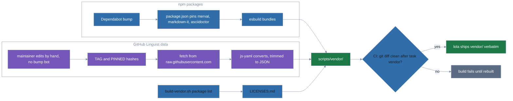

# Vendored dependencies

How docs-discipline ships its npm packages and GitHub Linguist's data inside
the module. Part of the maintainer docs; see [architecture.md](architecture.md)
for the rest of the internals.



The skill shells out to several npm packages: `@aj-archipelago/merval` for
mermaid validation; `markdown-it` plus its `markdown-it-footnote`,
`markdown-it-container`, and `markdown-it-admon` plugins for the Markdown
adapter; and `@asciidoctor/core` for the AsciiDoc adapter. None would survive
an install as npm packages — lola strips any directory named `node_modules`
from the copy it ships. The staleness lane also needs GitHub Linguist's
language, vendor, and documentation data; that isn't an npm package but a
build-time fetch, trimmed to what `check-staleness.mjs` needs. The three npm
bundles and the Linguist data land in `scripts/vendor/`, which lola ships verbatim.

The name is the entire constraint. lola's `ALWAYS_IGNORE` is a fixed set of
directory names (`node_modules` among them, `vendor` not), not a rule about
dependencies in general, so a `vendor/` directory ships verbatim at any depth.
The npm packages are MIT and bundle cleanly, and Linguist's data (also MIT) is
trimmed to what `check-staleness.mjs` needs, so all of it ships pre-built,
alongside the licence file that covers them:

```text
scripts/vendor/merval.mjs        92K   @aj-archipelago/merval, no deps
scripts/vendor/markdown-it.mjs  256K   markdown-it + footnote/container/admon plugins + 6 transitive deps
scripts/vendor/asciidoctor.mjs  864K   @asciidoctor/core, no deps
scripts/vendor/linguist.json     20K   extensions, filenames, exclude patterns from GitHub Linguist
scripts/vendor/LICENSES.md             license texts for the six bundled packages, their six transitive deps, and Linguist (MIT, except argparse: Python-2.0, entities: BSD-2-Clause)
```

`.taskfiles/vendor/package.json` keeps the six bundled npm packages as
`devDependencies` — they are
build inputs, not runtime imports — alongside a pinned `esbuild` and `js-yaml`
(used only to convert Linguist's YAML sources to JSON at build time).
`task vendor` installs that toolchain and regenerates all five files in
`scripts/vendor/`. CI reruns it and fails on a non-empty `git diff` of that
directory, so a committed bundle
can never drift from the version `package.json` pins. A Dependabot bump
therefore arrives red until the bundles are rebuilt, which is the intended
signal.

That toolchain, and the scripts' unit tests and fixtures (under
`tests/scripts/<skill>/`), live outside `module/` on purpose. lola copies every
git-tracked file under the module and ignores only `.gitignore` plus its fixed
`ALWAYS_IGNORE` set, so anything development-only left in a skill's `scripts/`
lands in the user's `.claude/skills/`. esbuild resolves bare specifiers from
the entry file's directory, so `build-vendor.sh` writes its temporary entry
points inside `.taskfiles/vendor/`. The bundles embed each module's path
relative to the repo root (`.taskfiles/vendor/node_modules/...`), so moving the
toolchain again means rerunning `task vendor` and committing the result.

GitHub Linguist's data is pinned separately: `.taskfiles/scripts/build-linguist-data.mjs`
hardcodes the fetched tag (`TAG`) and a SHA-256 per file (`PINNED`).
Dependabot's `npm` entry covers the vendor toolchain's `package.json` (the six
bundled packages plus esbuild and js-yaml), so it never opens a bump PR for the
Linguist fetch. `task vendor`, which CI also runs, needs
network access to `raw.githubusercontent.com`, not just the npm registry. To
bump it, follow [Bump the GitHub Linguist data](maintaining.md#bump-the-github-linguist-data).

`LICENSES.md` is assembled by `build-vendor.sh` from the installed packages'
own metadata and licence files, because esbuild only preserves `/*! */` legal
comments and none of the bundled packages use them. The list of packages to walk is
hardcoded in that script, so a new transitive dependency has to be added there
by hand.

Two consequences worth knowing. `MERVAL_NOT_INSTALLED` no longer exists — the
gap it reported cannot occur. And the [install oracle](architecture.md#the-install-oracle) asserts that every file
under a source skill directory arrives in the installed copy, which is what
would catch lola widening `ALWAYS_IGNORE` to swallow `vendor/`.

The alternative was a `module/lola.yaml` `post-install` hook running `npm
install` at the destination. It is blocked anyway: in lola v0.7.0 the hook
runner passes an empty `cwd` at user scope, so the hook dies with
`FileNotFoundError` and lola misreports it as "script is not executable".
Hooks work at project scope. Even fixed, a hook would need network and npm at
every install; vendoring needs neither.
