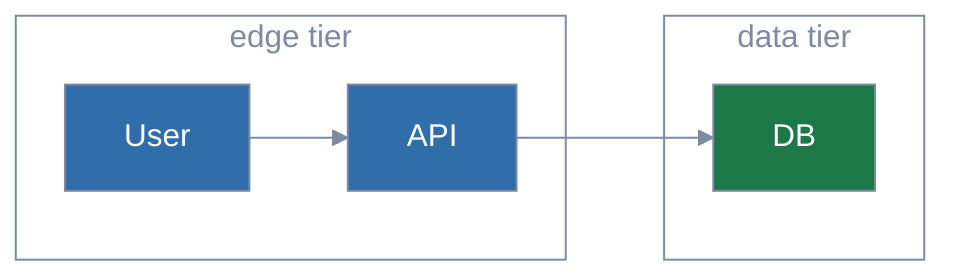

# Mermaid house style

Every diagram begins with a palette init header and uses `classDef` entries
from the approved palette. `/diagram-test` enforces this.

## Pick a palette

| Palette | Mood | Cluster shape | Backgrounds |
|---------|------|---------------|-------------|
| **Solar** (default) | Cool jewel tones (sapphire, emerald, amethyst, teal, indigo, slate) | Outlined transparent | Light + dark |
| **Federation** | Cool balanced (steel blue, forest green, terracotta, violet, deep teal, slate) | Outlined transparent | Light + dark |
| **Citrus** | Warm earth (terracotta, olive, amber, burgundy, sand, slate) | Outlined transparent | Light + dark |
| **Parchment** | Federation colors + filled beige clusters | Filled pale neutral | **Light only** |

Palette JSONs live next to this file in `palettes/`. ER diagrams also need
`palettes/er-overrides.css` at render time — `/diagram-test` applies it
automatically; direct `mmdc` users pass `--cssFile`.

## When to reach for a diagram

| Describing… | Use… | Why |
|---|---|---|
| How subsystems connect | `flowchart` (or C4) | A node-and-edge picture beats a paragraph naming connections |
| Multi-actor interaction over time | `sequenceDiagram` | Time-ordered arrows expose causality |
| State transitioning through phases | `stateDiagram-v2` | Cycles and dead ends become visible |
| A branching decision | `flowchart` with decision nodes | Branches are the point — prose linearizes them |
| Data flowing through pipeline stages | `flowchart LR` with annotated edges | Shape-at-each-stage is hard to track in prose |
| Entity / model relationships | `erDiagram` | One-to-many vs. many-to-many is a diagram's domain |

Skip the diagram for: a single linear sequence (use a numbered list), a
fixed list (use a table), an isolated concept (use prose).

## Init header (Solar — the default)

Paste this at the top of every `.mmd` file and every fenced ` ```mermaid `
block:

```text
%%{init: {'theme': 'base', 'themeVariables': {
  'primaryColor': '#2f6dab',
  'primaryTextColor': '#1e1e1e',
  'primaryBorderColor': '#7c8ba1',
  'lineColor': '#7c8ba1',
  'edgeLabelBackground': '#eef2f8',
  'tertiaryColor': 'transparent',
  'tertiaryTextColor': '#7c8ba1',
  'tertiaryBorderColor': '#7c8ba1',
  'clusterBkg': 'transparent',
  'clusterBorder': '#7c8ba1',
  'titleColor': '#7c8ba1',
  'noteBkgColor': '#eef2f8',
  'noteTextColor': '#1e1e1e',
  'fontFamily': 'system-ui, sans-serif'
}, 'themeCSS': '.node .nodeLabel{color:#ffffff!important;fill:#ffffff!important;}'}}%%
```

Then for any nodes you want palette-colored, add classDefs at the bottom
(only those used):

```text
  classDef sysA fill:#2f6dab,color:#ffffff,stroke:#7c8ba1
  classDef sysB fill:#1d7848,color:#ffffff,stroke:#7c8ba1
  classDef sysC fill:#7457b8,color:#ffffff,stroke:#7c8ba1
  classDef sysD fill:#2d747e,color:#ffffff,stroke:#7c8ba1
  classDef sysE fill:#4d68c4,color:#ffffff,stroke:#7c8ba1
  classDef sysF fill:#5c6a82,color:#ffffff,stroke:#7c8ba1
```

Apply with `class <node1>,<node2> <className>`. The inline form
`<node>:::<className>` is rejected by the linter for nodes with explicit
shapes.

## Switching palette

Each non-default palette overrides only the colors. Take the Solar header
above and substitute the values from this table:

| Variable               | Solar       | Federation  | Citrus      | Parchment   |
|------------------------|-------------|-------------|-------------|-------------|
| `primaryColor`         | `#2f6dab`   | `#3e6fa0`   | `#a55726`   | `#3e6fa0`   |
| `primaryBorderColor`   | `#7c8ba1`   | `#7c8ba1`   | `#9a8770`   | `#8d8475`   |
| `lineColor`            | `#7c8ba1`   | `#7c8ba1`   | `#9a8770`   | `#8d8475`   |
| `edgeLabelBackground`  | `#eef2f8`   | `#f5f5f5`   | `#f5f0e8`   | `#ffffff`   |
| `tertiaryTextColor`    | `#7c8ba1`   | `#7c8ba1`   | `#9a8770`   | `#3a342c`   |
| `tertiaryBorderColor`  | `#7c8ba1`   | `#7c8ba1`   | `#9a8770`   | `#8d8475`   |
| `clusterBkg`           | transparent | transparent | transparent | `#ebe7df`   |
| `clusterBorder`        | `#7c8ba1`   | `#7c8ba1`   | `#9a8770`   | `#8d8475`   |
| `titleColor`           | `#7c8ba1`   | `#7c8ba1`   | `#9a8770`   | `#3a342c`   |
| `noteBkgColor`         | `#eef2f8`   | `#f5f5f5`   | `#f5f0e8`   | `#ffffff`   |
| `tertiaryColor`        | transparent | transparent | transparent | `#ebe7df`   |

classDef fills:

| Class | Solar      | Federation | Citrus     | Parchment (= Federation) |
|-------|------------|------------|------------|--------------------------|
| sysA  | `#2f6dab`  | `#3e6fa0`  | `#a55726`  | `#3e6fa0`                |
| sysB  | `#1d7848`  | `#3a8054`  | `#5f7a23`  | `#3a8054`                |
| sysC  | `#7457b8`  | `#a55726`  | `#9b6320`  | `#a55726`                |
| sysD  | `#2d747e`  | `#7457b8`  | `#a64a72`  | `#7457b8`                |
| sysE  | `#4d68c4`  | `#2d747e`  | `#8e6e3a`  | `#2d747e`                |
| sysF  | `#5c6a82`  | `#5a6a7e`  | `#5a6a7e`  | `#5a6a7e`                |

Node text is `#ffffff` (white) in every palette. The `themeCSS` snippet in
the init header forces white text on default (non-classDef'd) nodes so
diagrams render correctly without per-node classDefs.

## Re-applying a palette

`scripts/swap-palette.sh [--block N] <palette> <file>` strips a diagram's
init header and the palette's own `classDef`s (`sysA`…`sysF`) and writes the
named palette's validated ones. Custom `classDef`s, `style` statements, and
every node, edge, and `class` line are kept. It prints to stdout: write to
`<file>.new`, then move that over `<file>` — redirecting onto `<file>` empties
it before the script reads it.

A `.mmd` is one diagram. In a `.md` the script swaps every mermaid fence —
` ```mermaid ` or `~~~mermaid` — or only `--block <block>` (the `block`
field from `lint-mermaid --json`, numbered the same way regardless of which
fence character a diagram uses), and leaves every byte outside the swapped
fences unchanged. It exits 2 with a reason
and no output for an unknown palette, a `--block` past the last fence, a
fence with no diagram, an unterminated init header, or a fence indented
inside a list item or blockquote.

### Repairing a palette by hand

For what the script refuses or does not touch — an indented fence, a
`classDef edgeLabel`:

1. Take the palette's values from `palettes/<palette>.json`: `nodes.sysX`
   `fill`/`text` for a `sysX` class, `edgeLabel` `bg`/`text` for
   `edgeLabel`, and the init header from the tables above.
2. Replace the init header and the drifted `classDef` inside the diagram
   only. In an indented fence keep every line's indentation.
3. Run `scripts/lint-mermaid.mjs` on the file and confirm no findings.

## Syntax constraints

The linter uses merval, a strict subset of mermaid's grammar:

1. **Quote labels containing `:`, `,`, `(`, or `)`** — `B["Lane 1: structural"]` not `B[Lane 1: structural]`.
2. **Only some flowchart shapes parse.** These are valid mermaid but the
   linter's parser (merval 1.0.7, the latest release) rejects them with a
   misleading "Expected closing bracket" error, so the `SYNTAX_ERROR` message
   names the shape:

   | Accepted | Rejected |
   | --- | --- |
   | `[text]` rectangle | `([text])` stadium |
   | `(text)` rounded | `[[text]]` subroutine |
   | `((text))` circle | `[(text)]` cylinder |
   | `{text}` rhombus | `>text]` asymmetric |
   | `[/text/]` `[\text\]` parallelogram | `{{text}}` hexagon |
   | `[/text\]` `[\text/]` trapezoid | `(((text)))` double circle |
   | | `A@{ shape: … }` expanded syntax |

   Swap a rejected shape for an accepted one, e.g. a datastore as `[text]`
   rather than `[(text)]`.
3. **Inline class `node["label"]:::sysX` is rejected** for nodes with explicit shapes. Use `class node1,node2 sysA` instead.
4. `/`, `?`, `<br/>`, hyphens, and ampersands work unquoted.

A syntax error does not hide the other checks: the header, class-name and
contrast checks read the diagram text, so they still report on a diagram
merval rejects. Every finding carries a 1-based `line` in its file (for a
fenced block, lines count from the top of the `.md`).

## ER edge labels — known mermaid quirk

Mermaid hardcodes `.labelBkg { background-color: rgba(0, 0, 0, 0.5); }` in
its emitted SVG for ER relationship labels, ignoring theme variables.
`palettes/er-overrides.css` restores legibility by forcing a light pill
background with dark text. `/diagram-test` applies it via `--cssFile`
automatically.

## Worked example



## Why this design

Mermaid renders inline in markdown viewers and chat panes that may use
either light or dark backgrounds. The four palettes land node fills in the
narrow WCAG luminance band `[0.13, 0.183]` — the only range where a fill
clears 3:1 contrast against both `#ffffff` and `#1e1e1e`. White node text
on those fills clears 4.5:1 (AA). Mid-tone canvas/cluster text clears 3:1
(AA Large) on both backgrounds.

Setting `primaryTextColor: '#1e1e1e'` (dark) keeps edge labels, axis
labels, ER attributes, sankey/radar/quadrant text legible. The `themeCSS`
override then forces white text on node fills so default nodes still read
correctly without a classDef.

## Colors outside the palette

There is no opt-out marker. Reach for an approved class first: `sysA` …
`sysF` give six contrast-checked fills per palette, and `edgeLabel` covers
edge text.

If a diagram truly needs another color, keep the custom `classDef`. The
linter reports it as an `UNAPPROVED_CLASSNAME` **warning**, not a blocker:

- The run still exits 1, so the warning is visible in review and has to be
  accepted there.
- The contrast checks skip classes outside the approved set. Verify the
  color by hand: text on fill at least 4.5:1, and fill at least 3.0:1
  against both `#ffffff` and `#1e1e1e`.

A `style <node> fill:…,color:…` statement is the per-node form of the same
escape hatch. Any `style` that sets `fill`, `color`, or `stroke` is an
`UNAPPROVED_STYLE` **warning** — replace it with `class <node> sysX`. Unlike
a custom `classDef`, its colors are still contrast-checked, and a failure is
a `LOW_CONTRAST_*` blocker whose message begins `style "<node>"`.

Colors may be hex (`#rgb`, `#rrggbb`) or any of the 148 CSS named colors
(`yellow`, `rebeccapurple`, …) in both `classDef` and `style`. Other forms
(`transparent`, `rgb()`, 4- or 8-digit hex) are not contrast-checked.
