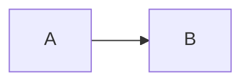

# Sample Document

An opening paragraph that links to [the guide](guide.md) and cites §4.2.

## Lists

- first item with an image 
  - nested item
- second item

## Quotes and callouts

>
> A quoted paragraph.
>

!!! note
    A callout paragraph with [a link](https://example.com/callout).

### Detail

Closing paragraph citing §7 without any link.

> [!TIP]
> Alert body text.
