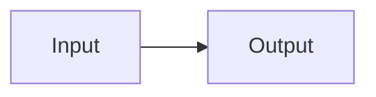

# Mixed fences

Prose before the first diagram, fenced with backticks.

More prose. The second diagram is fenced with tildes.

~~~mermaid
flowchart LR
  C[Input] --> D[Output]
  classDef myCustomClass fill:#3e6fa0,color:#ffffff
~~~
